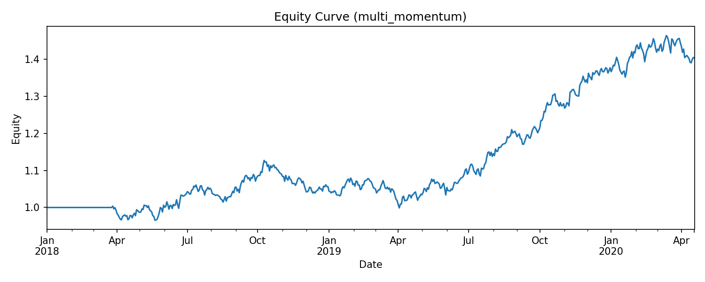
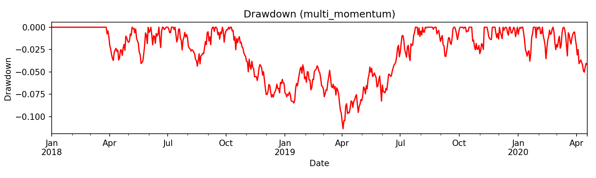

# QBT-Lite 📈  
A lightweight quantitative backtesting framework in Python

---

## 🌟 Project Overview
This project is a **from-scratch backtesting framework** that covers the full workflow of  
**data import → strategy execution → order simulation → performance evaluation → automated reporting**.  

It is designed for **educational purposes** and as a **portfolio project** to demonstrate quantitative research skills.

**Resume Highlights:**
- Built an end-to-end backtesting framework from data loading, strategy execution, to performance reporting  
- Supports **multi-asset backtesting** and **portfolio simulation**  
- Calculates return, volatility, Sharpe ratio, and max drawdown  
- Automatically generates equity curves, drawdown charts, and performance reports  

---

## ⚙️ Tech Stack
- **Python 3.10+**
- **pandas** for data handling  
- **matplotlib** for visualization  
- **pytest** (optional, for unit testing extension)

---

## 📂 Project Structure
```
qbt-lite/
│── qbt/
│   ├── core/              # Engine, broker, portfolio
│   ├── data/              # Data loading
│   ├── strategies/        # Strategy library (SMA, Momentum, Top-N Momentum)
│   └── report/            # Automated report generation
│
│── examples/
│   ├── run_sma_example.py          # SMA strategy demo
│   ├── run_momentum_example.py     # Single-asset momentum demo
│   ├── run_multi_momentum.py       # Multi-asset Top-N momentum demo
│   └── output/                     # Output charts
│
│── reports/                        # Auto-generated reports (CSV/Markdown/PNG)
│── README.md
```

---

## 🚀 Quick Start
### 1. Clone repository
```bash
git clone https://github.com/<your-username>/qbt-lite.git
cd qbt-lite
```

### 2. Install dependencies
```bash
pip install -r requirements.txt
```

### 3. Run examples
#### SMA strategy
```bash
python -m examples.run_sma_example
```

#### Single-asset momentum
```bash
python -m examples.run_momentum_example
```

#### Multi-asset Top-N momentum
```bash
python -m examples.run_multi_momentum
```

Results will be saved under `reports/`:
- Performance tables (CSV / Markdown)  
- Equity curve chart  
- Drawdown chart  

---

## 📊 Example Results

### Performance Table
| annual_return | annual_vol | sharpe | max_drawdown | total_return |
|---------------|------------|--------|--------------|--------------|
| 0.1603        | 0.1123     | 1.3243 | -0.1137      | 0.4028       |

### Equity Curve


### Drawdown Curve


---

## 🔮 Future Improvements
- Add more strategies (mean reversion, pairs trading, CTA futures)  
- Advanced portfolio allocation (Kelly, risk parity)  
- Integrate with live data sources (Tushare / yfinance)  
- Web dashboard (Streamlit / Dash)  

---

## 📜 License
MIT License

---

## 🤝 Acknowledgements
This project is for learning and portfolio demonstration only. **Not financial advice.**
