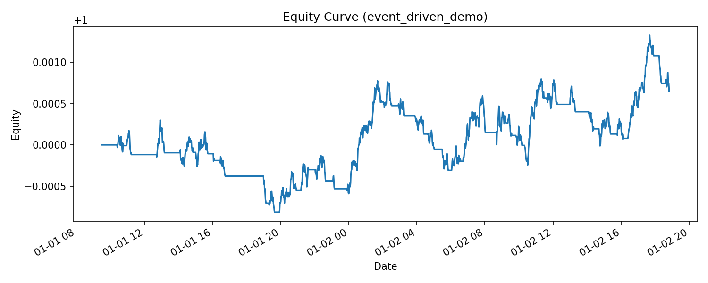
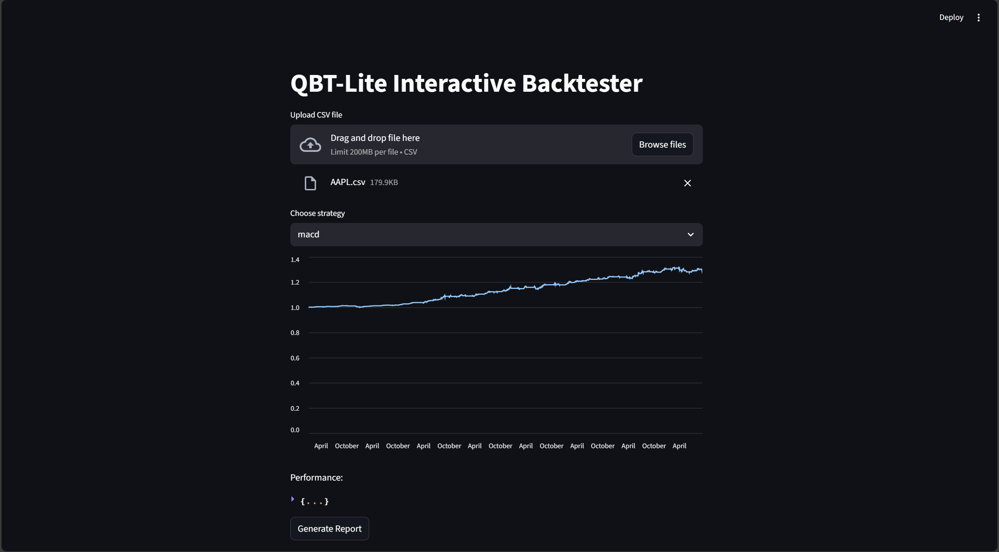

# QBT-Lite 📈  
A lightweight quantitative backtesting framework in Python

---

## 🌟 Project Overview
QBT-Lite is a **from-scratch quantitative backtesting framework** written in Python.  
It covers the entire workflow:  
**data import → strategy execution → order simulation → performance evaluation → automated reporting → interactive visualization**.

This project is designed for **learning purposes** and as a **portfolio project** to demonstrate quantitative research and engineering skills.

**Resume Highlights:**
- Built an end-to-end backtesting framework from data loading to reporting  
- Supports **multi-asset portfolio backtesting** and strategy evaluation  
- Includes multiple trading strategies (SMA, Momentum, Bollinger Bands, RSI, MACD)  
- Provides key metrics (Sharpe, Sortino, Calmar, Max Drawdown, etc.)  
- Exports automated reports (CSV, Markdown, PNG charts)  
- Comes with an **interactive Streamlit app** for easy strategy testing  
- **NEW in v0.3.0**: Event-driven backtesting engine (intraday), trade-level metrics (win rate, profit factor, etc.)

---

## ⚙️ Tech Stack
- **Python 3.10+**
- **pandas** for data handling  
- **numpy** for calculations  
- **matplotlib** for visualization  
- **pytest** for testing  
- **streamlit** + **plotly** (optional, for interactive UI)  
- **yfinance / tushare** (optional, for real market data)  

---

## 📂 Project Structure
```
qbt-lite/
│── qbt/
│   ├── core/              # Engine, broker, portfolio, metrics, event_engine (NEW)
│   ├── data/              # Data loading utilities
│   ├── strategies/        # Strategy library (SMA, Momentum, TA strategies)
│   ├── analytics/         # Extended metrics (Sortino, Calmar, Trade-level) (NEW)
│   └── report/            # Automated reporting module
│
│── examples/
│   ├── run_sma_example.py          # SMA strategy demo
│   ├── run_momentum_example.py     # Single-asset momentum demo
│   ├── run_multi_momentum.py       # Multi-asset Top-N momentum demo
│   ├── run_event_driven_demo.py    # Event-driven intraday demo (NEW)
│   └── configs/                    # Example config files (YAML/JSON)
│
│── reports/                        # Auto-generated reports (CSV/Markdown/PNG)
│── streamlit_app.py                # Interactive Streamlit dashboard (highlighted)
│── tests/                          # Basic pytest unit tests
│── pyproject.toml                   # Packaging & dependencies
│── README.md
│── CHANGELOG.md
```

---

## 🚀 Quick Start

### 1. Clone repository
```bash
git clone https://github.com/LinShuyue2003/qbt-lite.git
cd qbt-lite
```

### 2. Setup environment
```bash
python -m venv .venv
source .venv/bin/activate   # Linux / Mac
.\.venv\Scripts\Activate.ps1   # Windows PowerShell

pip install -U pip
pip install -e .
```

For optional features:
```bash
pip install pyyaml streamlit yfinance plotly pytest
```

### 3. Run examples
#### SMA strategy
```bash
python -m examples.run_sma_example
```

#### Single-asset momentum
```bash
python -m examples.run_momentum_example
```

#### Multi-asset Top-N momentum (using config file)
```bash
python -m qbt.cli --strategy topn_momentum --config examples/configs/multi_momentum.yml --report_name demo_multi
```

Reports are saved in `reports/`:
- Performance metrics (`.csv`, `.md`)  
- Equity curve (`.png`)  
- Drawdown curve (`.png`)  

---

## 🖥️ Command Line Interface (CLI)
QBT-Lite comes with a CLI entry point:

```bash
qbt-lite --strategy momentum --symbol MOCK --lookback 60 --report_name cli_mom
```

Or equivalently:
```bash
python -m qbt.cli --strategy momentum --symbol MOCK --lookback 60 --report_name cli_mom
```

Available strategies:
- `sma` → Moving Average Crossover  
- `momentum` → Single-asset momentum  
- `topn_momentum` → Multi-asset Top-N momentum  
- `bbands` → Bollinger Bands breakout  
- `rsi` → RSI mean reversion  
- `macd` → MACD crossover  

---

## ⏱️ Event-Driven Backtest (NEW in v0.3.0)
Run the new intraday event-driven demo:
```bash
python -m examples.run_event_driven_demo
```
Features:
- Processes **minute bars** with event queue: Market → Strategy → Order → Fill  
- Broker applies **commission + slippage**  
- Portfolio logs **fills & equity**  
- Produces both **return-based** and **trade-level** metrics  

Outputs (in `reports/`):
- `event_driven_demo_metrics.csv` / `.md`
- `event_driven_demo_equity.png` / `event_driven_demo_drawdown.png`



---

## 📊 Example Performance Metrics
Example results for multi-asset Top-N momentum (daily vectorized):

| annual_return | annual_vol | sharpe | max_drawdown | total_return | sortino | calmar | information_ratio |
|---------------|------------|--------|--------------|--------------|---------|--------|-------------------|
| 0.1858        | 0.1102     | 1.5473 | -0.0643      | 0.4780       | 2.4103  | 2.8895 | nan               |

Example results for event-driven SMA (minute bars):

| num_trades | win_rate | profit_factor | avg_win | avg_loss | max_win | max_loss |
|------------|----------|---------------|---------|----------|---------|----------|
| 37         | 0.2973   | 1.2227        | 37.21   | -12.87   | 104.98  | -33.35   |

---

## 📡 Real Market Data
You can fetch real data with **yfinance**:

```python
import yfinance as yf, pandas as pd
df = yf.download("AAPL", start="2018-01-01", progress=False)
df = df.rename(columns={
    "Open":"open","High":"high","Low":"low","Close":"close","Volume":"volume"
}).reset_index().rename(columns={"Date":"datetime"})
df.to_csv("examples/data_sample/AAPL.csv", index=False)
```

Then run:
```bash
python -m qbt.cli --strategy momentum --symbol AAPL --data_csv examples/data_sample/AAPL.csv --lookback 60 --report_name aapl_mom
```

---

## 📈 Interactive Dashboard (Streamlit) ⭐
The **Streamlit app** is the easiest way to experiment with strategies.

Run:
```bash
python -m streamlit run streamlit_app.py
```

Features:
- Upload CSV data (`datetime, open, high, low, close, volume`)  
- Choose strategy (SMA, Momentum, Bollinger, RSI, MACD)  
- Set parameters interactively  
- View equity curve in real time  
- Export full reports to `reports/`  

👉 This app is highly recommended for showcasing the project.  



---

## 🧪 Tests
Run basic unit tests with:
```bash
pytest -q
```

---

## 🔮 Future Improvements
- Add more advanced strategies (pairs trading, factor models, CTA futures)  
- Expand portfolio allocation methods (Kelly, risk parity, volatility targeting)  
- Integrate live data (tushare, Alpaca API, ccxt for crypto)  
- Deploy full Streamlit/Flask dashboard with parameter tuning  
- Continuous Integration (GitHub Actions / GitLab CI)  
- More order types (stop/limit, latency modeling)

---

## 📜 License
MIT License

---

## 🤝 Acknowledgements
This project is for learning and portfolio demonstration only. **Not financial advice.**
